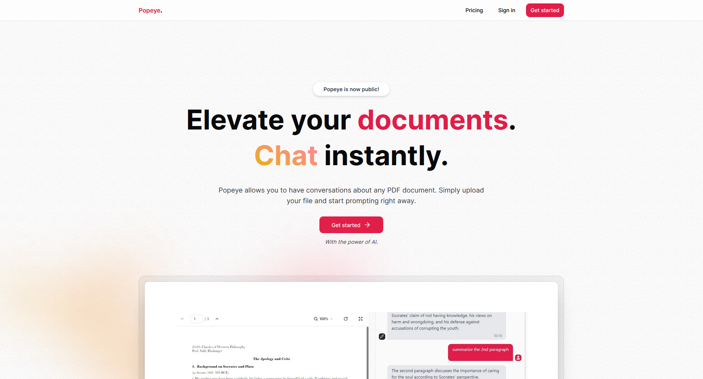
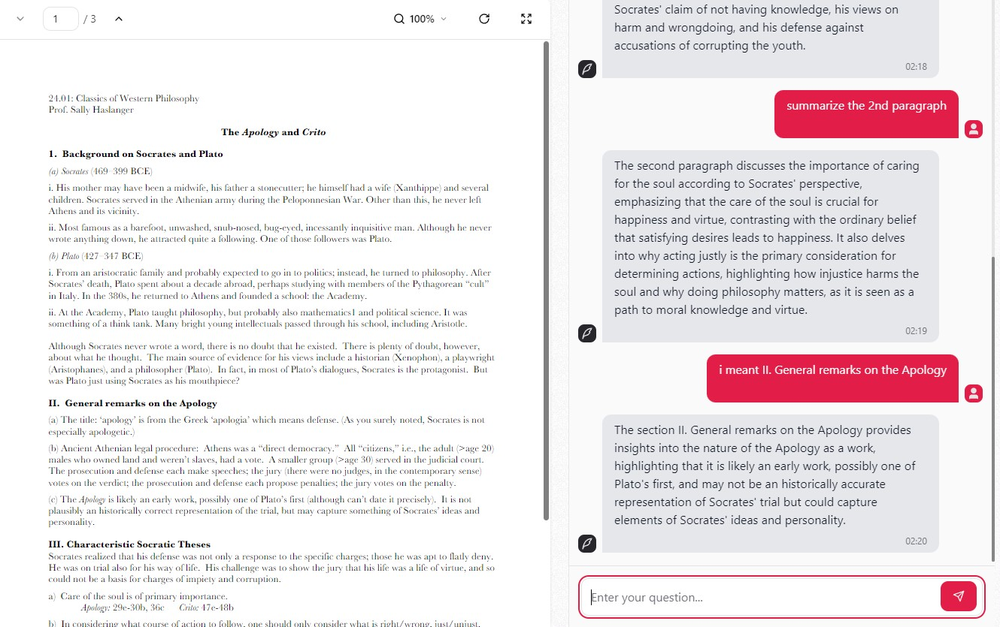

# Popeye: Chat with Your PDFs

Welcome to Popeye, a powerful AI-driven platform that allows you to upload PDF documents and interact with them through an intuitive chat interface. Whether you're a student, researcher, or professional, Popeye simplifies document analysis by enabling you to ask questions, extract insights, and summarize content—all in seconds.



## Features

- Upload PDF documents and interact with them through a chat interface
- Ask questions, extract insights, and summarize content in any language
- View the document and chat side-by-side with effortless navigation



## Getting Started

> ⚠️ Popeye was originally hosted on Vercel, but due to financial considerations, the live hosting has been shut down.

First, install your dependencies:

```bash
npm install
```

Then, run the development server:

```bash
npm run dev
```

Open [http://localhost:3000](http://localhost:3000) with your browser to interact with the application.

You can also build for production and run it locally:

```bash
npm run build
npm run start
```

## Technologies Used

<a href="https://nextjs.org/"></a>
<a href="https://tailwindcss.com/"></a>
<a href="https://www.prisma.io/"></a>
<a href="https://stripe.com/"></a>

- [OpenAI](https://openai.com/) for AI-powered chat
- [Pinecone](https://www.pinecone.io/) as the vector database
- [PlanetScale](https://planetscale.com/) as a serverless MySQL database
- [Kinde](https://kinde.com/) integration for seemless third-party authentication
- [Radix UI](https://www.radix-ui.com/) for accessible and customizable components
- [tRPC](https://trpc.io/) for building the type-safe API
- [uploadthing](https://uploadthing.com/) to handle file uploads
- [Zod](https://zod.dev/) for schema validation

